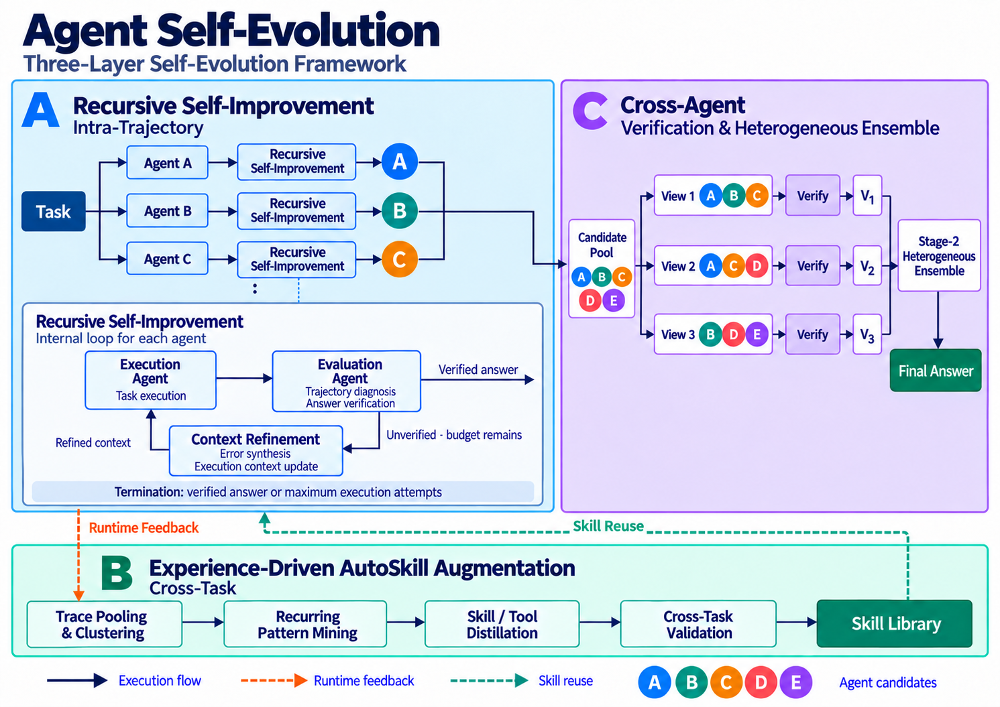

# Self-Evolving Agents

**English** | [简体中文](README.zh-CN.md)

Agents that improve recursively during execution, build reusable skills across tasks, and verify answers through collaboration.

Self-Evolving Agents is a three-layer framework built around **intra-trajectory recursive self-improvement, cross-task skill accumulation, and cross-agent verification and ensemble**. It connects execution traces, verification results, and reusable skills to explore how agents can use feedback from real tasks to improve their problem-solving process over time.

> **Project status:** This repository currently shares the framework design and architecture diagrams. Implementation code will be open-sourced and added in future updates. Runnable code and installation instructions are not available at this stage.

## Why Self-Evolution?

Complex tasks often require multiple rounds of reasoning, tool use, and result checking. Recording and distilling errors, corrections, and effective approaches from one execution can provide useful experience for later tasks. A single problem may also produce several candidate answers that need further verification and integration.

The framework addresses these challenges at three levels:

- **Within a trajectory:** Use recursive self-improvement to diagnose execution trajectories, verify answers, and refine the execution context.
- **Across tasks:** Mine recurring patterns from execution traces and distill reusable skills or tools.
- **Across agents:** Verify candidate answers from multiple perspectives, then combine the results through a heterogeneous ensemble.

Here, self-evolution takes the form of improved execution strategies, accumulated and reused skills, and the verification and integration of candidate answers.

## Architecture

### A. Recursive Self-Improvement

**Intra-Trajectory**

A task is distributed to Agent A, Agent B, Agent C, and potentially additional agents. Each agent runs its own recursive self-improvement loop, and verified candidate answers enter the shared candidate pool.

The diagram shows the parallel agent paths above and expands their common internal mechanism below:

1. **Task execution:** The execution agent performs the task and produces an execution trajectory and a candidate answer.
2. **Evaluation:** The evaluation agent diagnoses the trajectory and verifies the answer.
3. **Context refinement:** If verification fails and execution attempts remain, error causes are summarized and loaded into the execution agent's context. The agent then executes the task again with the refined context.

The loop terminates when the answer passes verification or the maximum number of execution attempts is reached. Reaching the attempt limit does not imply that the answer has passed verification.

### B. Experience-Driven AutoSkill Augmentation

**Cross-Task**

This layer turns experience from multiple tasks into reusable capabilities. AutoSkill refers to the mechanism for distilling, validating, and accumulating skills from execution traces.

| Stage | Purpose |
| --- | --- |
| Trace Pooling & Clustering | Collect task execution records and group similar traces for pattern analysis. |
| Recurring Pattern Mining | Identify recurring problems, procedures, or effective approaches across tasks. |
| Skill / Tool Distillation | Turn reusable experience into skills or tools. |
| Cross-Task Validation | Evaluate the applicability of the distilled capabilities across different tasks. |
| Skill Library | Store validated skills for reuse in future tasks. |

The two dashed connections link task execution with skill accumulation:

- **Runtime Feedback:** Send trace information, such as execution steps, tool calls, errors, reflections, and verification results, into the pooling and clustering process.
- **Skill Reuse:** Apply capabilities accumulated in the skill library to later task executions.

This process allows experience from one task to contribute to work on other tasks.

### C. Cross-Agent: Verification & Heterogeneous Ensemble

Candidate answers from different agents first enter a candidate pool. Different combinations then form multiple verification views. The diagram illustrates three views:

| Verification view | Candidate combination | Verification result |
| --- | --- | --- |
| View 1 | A, B, C | V₁ |
| View 2 | A, C, D | V₂ |
| View 3 | B, D, E | V₃ |

Each view verifies its candidate answers. The resulting V₁, V₂, and V₃ then enter a second-stage heterogeneous ensemble to produce the final answer. These combinations illustrate the mechanism; the number of candidates, view construction, and ensemble strategy will be specified in the future implementation.

## How a Task Contributes to Self-Evolution

1. **Execute and improve:** A task enters the execution layer. Each agent runs its own recursive self-improvement loop, and verified answers enter the candidate pool.
2. **Verify and combine:** Candidate answers enter the pool, pass through multi-view verification and the heterogeneous ensemble, and yield a final answer.
3. **Accumulate experience:** Execution traces enter the cross-task process as runtime feedback. Pattern mining, skill distillation, and cross-task validation contribute reusable capabilities to the skill library.
4. **Reuse in later tasks:** New tasks use existing skills and generate further execution feedback.

## Related Product

Try **Agentic Search** from Alibaba Cloud OpenSearch, or read the product documentation to learn about its capabilities and usage.

| Resource | Link |
| --- | --- |
| Product activation and trial | [Open the Agentic Search console](https://opensearch.console.aliyun.com/cn-shanghai/agentic-search#/agent/session) |
| Product documentation | [Agentic Search: AI-driven next-generation enterprise search (Chinese)](https://help.aliyun.com/zh/open-search/search-platform/product-overview/agentic-search-ai-driven-next-generation-enterprise-search) |

## Open-Source Progress

The framework overview in English and Chinese and the architecture diagram are available now. Implementation code will be added in future updates, with usage documentation accompanying its release.

Use Issues to discuss the design, ask questions, or share application scenarios you would like to explore.
