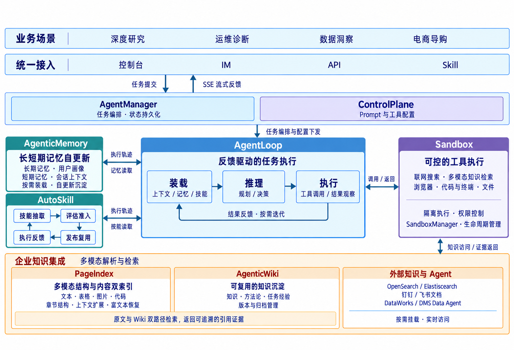
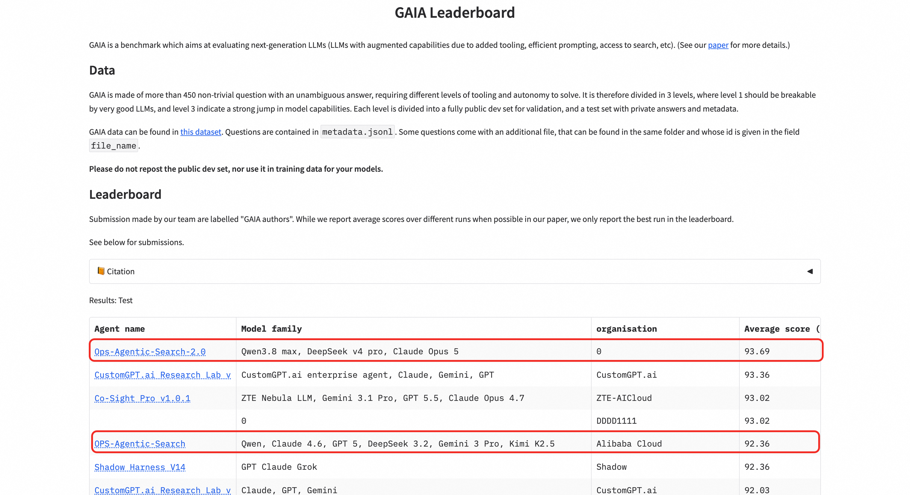

# AgenticSearch

[English](README.md) | **简体中文**

**AgenticSearch 是由阿里云 OpenSearch 团队开发的企业级智能体产品**，融合信息检索、推理规划与工具执行能力，面向**深度研究、运维诊断、数据洞察、电商导购**等复杂业务场景。用户只需描述任务目标，AgenticSearch 即可结合企业知识与联网信息，自主拆解任务、调用工具，并根据执行反馈调整求解过程，交付分析报告、数据洞察或可执行的处理结果。

[**产品开通与体验 →**](https://opensearch.console.aliyun.com/cn-shanghai/agentic-search#/agent/session) · [**产品说明文档 →**](https://help.aliyun.com/zh/open-search/search-platform/product-overview/agentic-search-ai-driven-next-generation-enterprise-search)

> 当前仓库介绍 AgenticSearch 背后的技术架构与 Self-Evolving Agents 自进化方案，相关实现代码将在后续逐步开源。

## 技术架构

AgenticSearch 以 **AgentLoop 执行闭环**为核心，将任务编排、长短期记忆、技能积累、多模态知识检索与沙箱工具执行协同起来，形成从任务接入到结果交付的完整链路。

任务通过控制台、IM、API 或 Skill 接入，由 AgentManager 编排并持久化状态，ControlPlane 管理 Prompt 与工具配置。AgentLoop 按需装载记忆、技能与上下文，完成规划决策和工具调用；执行结果反馈至下一轮决策，执行进展通过 SSE 流式返回。任务轨迹进一步用于记忆更新与技能迭代，让经验持续服务于后续任务。

### 技术优势

- **反馈驱动的复杂任务求解：** AgentLoop 串联“装载 → 推理 → 执行”，根据工具返回与中间结果动态调整后续步骤，支持多步骤、跨工具的任务执行。
- **长短期记忆自更新：** AgenticMemory 结合长期用户画像与短期会话上下文，按需装载相关记忆，并根据任务轨迹持续更新和沉淀，支持跨轮次、跨任务的上下文复用。
- **经验驱动的技能演进：** AutoSkill 通过“技能抽取 → 评估准入 → 发布复用 → 执行反馈”形成闭环，将任务经验转化为可复用技能，让后续任务能够使用已经验证的方法。
- **多模态企业知识集成：** PageIndex 结合文档结构与内容双索引，覆盖文本、表格、图片和代码，通过上下文扩展与富文本恢复保留证据语境；AgenticWiki 沉淀知识、方法论与任务经验，原文与 Wiki 双路径检索提供可追溯的引用依据。
- **可控的工具执行：** Sandbox 承载联网搜索、多模态知识检索、浏览器、代码、终端与文件等工具，提供隔离执行与权限控制，SandboxManager 负责生命周期管理，支撑复杂任务中的工具协同。
- **企业系统按需集成：** 连接 OpenSearch、Elasticsearch、钉钉与飞书文档，以及 DataWorks、DMS Data Agent 等外部能力，将企业已有数据与工具纳入任务执行链路。

## GAIA 榜单 Top 1

**我们基于 AgenticSearch 构建的智能体方案，在 GAIA 榜单上取得了 Top 1 的成绩。**

GAIA 面向真实世界任务评估通用 AI 助手，要求系统综合运用多步推理、信息检索、多模态理解与工具调用等能力。围绕这类复杂任务，我们在 AgenticSearch 的执行框架上构建了 Self-Evolving Agents 方案，通过任务内递归改进、跨任务经验复用与跨 Agent 验证集成，提升任务求解能力。

> **榜单截图：待补充。**

<!--
GAIA 榜单截图预留位置。
收到真实截图后，将上方占位文字替换为图片引用，例如：

届时一并补充榜单日期、评测集或赛道、提交名称、分数及榜单链接。
-->

## Self-Evolving Agents 自进化方案

自进化的核心是让**执行反馈改善当前任务，让任务经验增强后续任务，让多 Agent 验证提高最终答案的可靠性**。方案从任务内、跨任务和跨 Agent 三个层次展开，连接任务执行、答案验证与经验积累。

### A. 递归自我改进

**Recursive Self-Improvement · Intra-Trajectory**

针对同一任务，多个 Agent 分别运行递归自我改进循环。执行 Agent 产生执行轨迹和候选答案，评估 Agent 进行**轨迹诊断与答案验证**；验证未通过时，总结错误原因并更新执行上下文，驱动下一轮求解。

循环在答案验证通过或达到最大执行次数时终止。验证通过的候选答案进入后续验证与集成环节；达到次数上限不代表答案通过验证。这一机制将评估反馈转化为具体的上下文改进，使重试能够针对已发现的问题进行修正。

### B. 经验驱动的 AutoSkill 增强

**Experience-Driven AutoSkill Augmentation · Cross-Task**

AutoSkill 将多个任务的执行轨迹转化为可复用的技能与工具，使任务经验能够跨任务积累和迁移。

**轨迹汇集与聚类 → 共性模式挖掘 → 技能 / 工具提炼 → 跨任务验证 → 技能库**

运行反馈（Runtime Feedback）持续提供执行步骤、工具调用、错误与验证结果；经过跨任务验证的技能沉淀到技能库，并通过技能复用（Skill Reuse）用于后续任务。新的执行反馈继续驱动技能迭代，形成从经验提炼到应用验证的闭环。

### C. 跨 Agent 验证与异构集成

**Cross-Agent · Verification & Heterogeneous Ensemble**

多个 Agent 的候选答案汇入候选答案池，再按不同组合构建多个验证视角。各视角分别核验候选答案，随后通过第二阶段的异构集成形成最终答案，降低对单一求解路径的依赖。

这三层机制共同构成持续改进的过程：**在当前任务中纠错，在后续任务中复用经验，并通过多视角验证汇聚结果。**

## 开源进展

当前仓库已提供产品技术架构与自进化方案说明，后续将逐步补充相关实现代码、运行指南与示例。

欢迎通过 Issues 交流技术方案、提出问题或分享应用场景。
